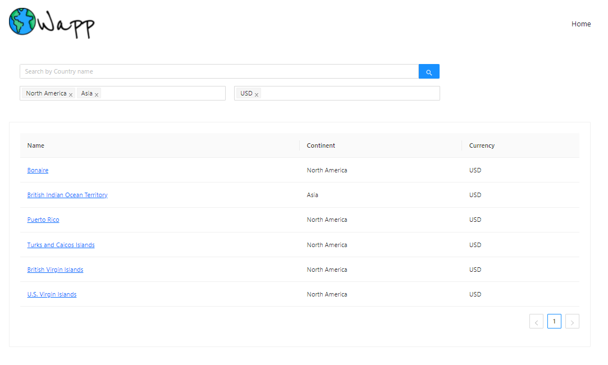
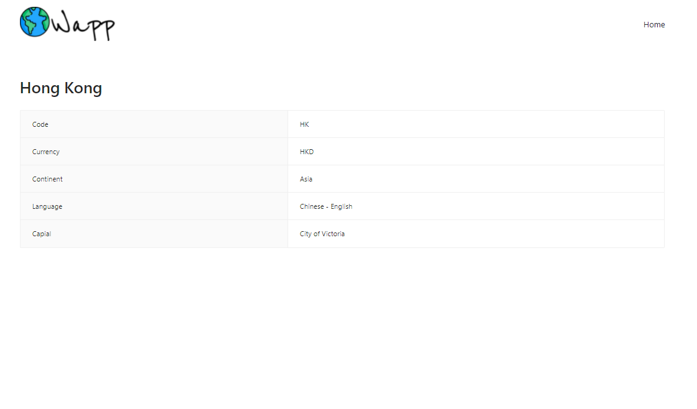

# World App
## Install dependencies

In the project directory, you can run:

### `npm install`

## Run project

In the project directory, you can run:

### `npm start`

Runs the app in the development mode.\
Open [http://localhost:3000](http://localhost:3000) to view it in the browser.

## Previews

 

